# 有序日常 — 设计说明书

文档编号：有序日常软件–DS–V2.3  
日期：2026.06.16  
作者：陈熙雅

---

## 目录

1. [系统概述](#1-系统概述) — 项目背景、技术选型、运行环境、**用例图**
2. [系统架构设计](#2-系统架构设计) — 三层架构图、目录结构、**数据流活动图**
3. [模块详细设计](#3-模块详细设计) — 6大模块 + **注册/登录/AI生成/日程CRUD活动图**
4. [数据库设计](#4-数据库设计) — **Mermaid ER图**、表结构DDL、索引、外键
5. [API 接口设计](#5-api-接口设计) — 16个端点完整规范
6. [前端组件设计](#6-前端组件设计) — **组件关系图**、CSS令牌体系、状态机
7. [安全设计](#7-安全设计)
8. [部署架构](#8-部署架构) — **开发/生产环境部署图**

---

## 1. 系统概述

### 1.1 项目背景

有序日常是一款面向学生和年轻上班族的轻量化综合生活管理工具，集智能日程管理、定时提醒、私密生活记录、AI 智能辅助于一体。系统采用前后端分离架构，前端基于 uni-app（Vue 3），后端基于 Express.js + MySQL。

### 1.2 技术选型

| 层级 | 技术 | 版本 | 选型理由 |
|------|------|------|----------|
| 前端框架 | uni-app (Vue 3) | Vue 3.x | 一套代码多端运行（H5/小程序/App） |
| 构建工具 | Vite | 5.x | 快速的 HMR 和构建 |
| 后端框架 | Express.js | 4.x | 轻量、成熟、生态丰富 |
| 数据库 | MySQL | 8.0 | 成熟的关系型数据库，支持事务和外键 |
| 数据库驱动 | mysql2/promise | 3.x | Promise 原生支持，连接池管理 |
| 认证 | JWT + bcryptjs | - | 无状态认证，密码安全哈希 |
| 文件上传 | multer | 1.x | Express 标准文件上传中间件 |
| AI 集成 | 阿里云百炼 qwen-plus | - | 中文 NLP 能力强，性价比高 |
| 进程管理 | PM2 | - | Node.js 进程守护 |

### 1.3 运行环境

| 组件 | 要求 |
|------|------|
| 客户端 | Android 8.0+ / iOS 12+ / 现代浏览器 (Chrome/Safari/Edge) |
| Node.js | v18+ |
| MySQL | 8.0+ |
| 操作系统 | Linux (生产) / Windows 11 / macOS |

### 1.4 用例图

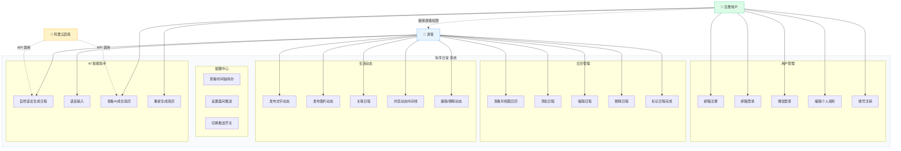

> **参与者说明**：
> - **游客**：无需注册即可使用基本功能（日程管理、动态发布、AI 日程生成），数据仅存储在本地浏览器
> - **注册用户**：拥有全部功能权限，数据云端同步，可使用 AI 成长简历
> - **阿里云百炼**：外部 AI 服务，提供自然语言解析和简历生成能力

---

## 2. 系统架构设计

### 2.1 整体架构

系统采用经典的三层架构（表示层、业务逻辑层、数据层），前端 SPA 通过 RESTful API 与后端交互。

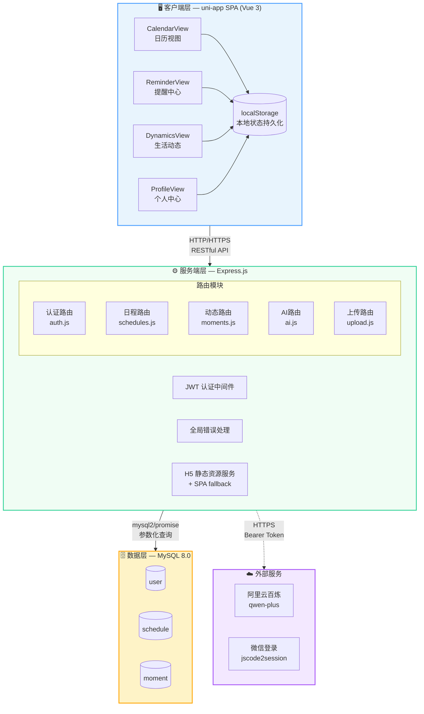

**架构说明**：
- **客户端层**：4 个视图组件构成 SPA，通过底部 Tab 切换；localStorage 提供离线数据缓存
- **服务端层**：Express.js 承载 5 组 API 路由，JWT 中间件保护需认证端点，全局错误处理防止进程崩溃
- **数据层**：MySQL 8.0，3 张核心表，通过外键约束保证数据完整性
- **外部服务**：阿里云百炼提供 AI 能力，微信 OAuth 提供社交登录（预留）

### 2.2 目录结构

```
有序日常/
├── pages/                          # uni-app 页面
│   └── index/index.vue             # 主入口 SPA 页面（~2200 行）
├── components/views/               # 四大模块视图组件
│   ├── CalendarView.vue            # 日历视图
│   ├── ReminderView.vue            # 提醒中心
│   ├── DynamicsView.vue            # 生活动态（朋友圈样式）
│   └── ProfileView.vue             # 个人中心（AI 成长简历）
├── services/                       # 前端服务层
│   ├── api.js                      # API 请求封装（16 个端点）
│   ├── storage.js                  # localStorage 状态管理
│   └── date.js                     # 日期工具函数
├── server/                         # 后端服务
│   ├── .env                        # 环境变量配置
│   ├── package.json
│   ├── uploads/                    # 上传文件存储目录
│   ├── scripts/
│   │   └── init_db.js              # 数据库初始化脚本
│   └── src/
│       ├── index.js                # Express 服务入口
│       ├── db.js                   # MySQL 连接池
│       ├── schema.sql              # 数据库表结构
│       ├── middleware/
│       │   └── auth.js             # JWT 认证中间件
│       └── routes/
│           ├── auth.js             # 用户认证路由
│           ├── ai.js               # AI 助手路由
│           ├── schedules.js        # 日程 CRUD 路由
│           ├── moments.js          # 动态 CRUD 路由
│           └── upload.js           # 文件上传路由
├── static/                         # 静态资源
├── App.vue                         # 应用根组件 + CSS 令牌体系
├── main.js                         # 应用入口
├── manifest.json                   # uni-app 应用配置
├── pages.json                      # 页面路由配置
├── vite.config.js                  # Vite 构建配置
└── 需求说明.txt                     # 软件需求规格说明书
```

### 2.3 数据流架构

用户操作遵循 **Local-First 离线优先** 模式：

```
用户操作 → localStorage 立即保存 → UI 更新
                                    ↓
                           后台异步 HTTP 同步到服务器
                                    ↓
                           服务器校验 → MySQL 持久化
                                    ↓
                           返回结果 → 更新 localStorage（服务端 ID）
```

**数据流活动图**：

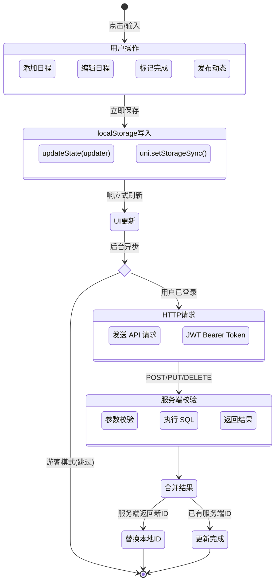

**核心原则**：
- 写入优先本地，确保离线可用
- 登录后合并本地与服务端数据（保留本地独有数据）
- 新用户注册清空本地种子数据，从服务端拉取

---

## 3. 模块详细设计

### 3.1 用户认证模块

**文件**: `server/src/routes/auth.js` (166 行)

**功能**：邮箱注册登录、资料管理、账号注销

**密码安全**：
- bcrypt.hash(password, 10) — 10 轮盐值哈希
- bcrypt.compare() — 登录验证
- 密码最小长度 6 位，邮箱格式校验

**JWT 设计**：
- 签名算法：HS256
- 有效期：7 天 (expiresIn: '7d')
- Payload：{ userId, email, nickname }
- 存储位置：客户端 localStorage (`orderlyDailyLife:token`)
- 传输方式：Authorization: Bearer \<token\>

**端点列表**：

| 方法 | 路径 | 认证 | 说明 |
|------|------|------|------|
| POST | /api/auth/register | 无 | 邮箱注册 |
| POST | /api/auth/login | 无 | 邮箱登录 |
| POST | /api/auth/wechat | 无 | 微信登录（保留） |
| GET | /api/auth/profile | JWT | 获取个人资料 |
| PUT | /api/auth/profile | JWT | 更新个人资料（动态 SQL） |
| DELETE | /api/auth/account | JWT | 注销账号（级联删除） |

**账号注销流程**：
1. 前端弹出二次确认弹窗，要求用户输入"确认注销"文字
2. 调用 DELETE /api/auth/account
3. 后端执行 `DELETE FROM user WHERE id = ?`
4. 外键约束 ON DELETE CASCADE 自动删除关联的 schedule 和 moment
5. 前端 clearSession() 清除本地状态

**用户注册活动图**：

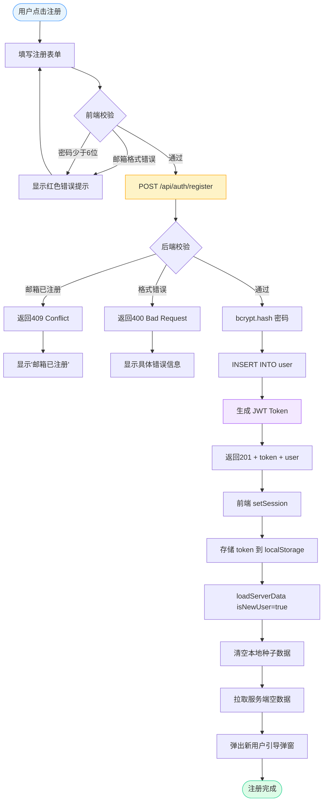

**登录活动图**：

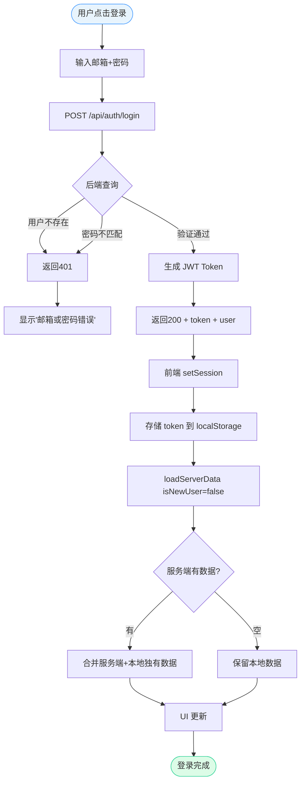

### 3.2 日程管理模块

**前端文件**: `components/views/CalendarView.vue`  
**后端文件**: `server/src/routes/schedules.js` (103 行)

**数据模型**：
- 标题、日期 (DATE)、时间 (TIME)、分类、优先级 (1-3)、备注、地点、完成状态、提醒时间
- 分类：学习(#4A90E2)、工作(#FFA500)、生活(#50C878) 三种默认分类

**日程同步策略**：
- GET /api/schedules：获取服务端全部日程
- 前端合并策略：服务端返回数据 + 本地独有数据（ID 不在服务端列表中的）
- 本地 ID 以 "sch-" 前缀标识，服务端 ID 为整数

**PUT 接口设计要点**：
- 动态构建 SQL，只更新请求中实际传入的字段
- 避免未传字段被覆盖为 null/undefined

**月视图日历网格**：
- 展示最近 30 天日期格子
- 格子内以横向彩色小标识展示当日任务
- 小标识颜色与日程分类颜色一致
- 最多显示 3 个标识，超出显示 "..."
- 点击任意日期格子快速新增日程

**日程 CRUD 操作活动图**：

```mermaid
flowchart TD
    A([用户操作]) --> B{操作类型}

    B -->|新增| C[点击日期格子/FAB按钮]
    C --> D[填写日程表单]
    D --> E[前端校验必填字段]
    E --> F{校验通过?}
    F -->|否| G[表单内红色提示]
    G --> D
    F -->|是| H[本地 addSchedule 保存]
    H --> I{用户已登录?}
    I -->|是| J[POST /api/schedules]
    J --> K[服务端 INSERT → 返回 ID]
    K --> L[更新本地 ID: sch-xxx → 数字ID]
    I -->|否| M[仅本地保存]
    L --> N[UI 更新]
    M --> N

    B -->|编辑| O[点击日程条目]
    O --> P[打开编辑弹窗(已填充)]
    P --> Q[用户修改字段]
    Q --> R[本地 updateSchedule]
    R --> S{用户已登录?}
    S -->|是| T[PUT /api/schedules/:id<br/>动态SQL只更新传入字段]
    T --> N
    S -->|否| N

    B -->|删除| U[长按/点击删除]
    U --> V[确认删除?]
    V -->|取消| A
    V -->|确认| W[本地 deleteSchedule]
    W --> X{用户已登录?}
    X -->|是| Y[DELETE /api/schedules/:id]
    Y --> N
    X -->|否| N

    B -->|标记完成| Z[点击复选框]
    Z --> AA[本地 toggleScheduleCompleted]
    AA --> AB{用户已登录?}
    AB -->|是| AC[PUT 更新 completed 字段]
    AC --> N
    AB -->|否| N

    N --> AD([UI 刷新])

    style A fill:#E8F4FD,stroke:#4A9EFF
    style AD fill:#DCFCE7,stroke:#34D399
    style H fill:#FEF3C7,stroke:#FFA500
```

**本地与服务端 ID 映射**：
- 本地新建日程使用 `sch-{timestamp}-{random}` 作为临时 ID
- 服务端 POST 成功后返回自增数字 ID
- 前端自动将本地临时 ID 替换为服务端数字 ID
- 后续 PUT/DELETE 操作使用服务端数字 ID

### 3.3 提醒中心模块

**前端文件**: `components/views/ReminderView.vue`

**功能设计**：
- 时间轴布局，垂直排列所有待办事项
- 分段展示：今日剩余 → 未来待办 → 已过期
- 时间轴主线浅灰色 (#E5E5E5)，线宽 2px
- 今日待办节点浅蓝色 (#4A90E2)，未来待办浅绿色 (#50C878)，已过期浅灰色 (#999)
- 已完成任务：line-through + opacity:0.6
- 未完成任务置顶，已完成排底部

**晨间推送**：
- 默认推送时间：08:00
- 用户可自定义推送时间
- 前端 localStorage 存储推送开关和设置

**排序逻辑**：
- 未完成任务置顶（按时间升序）
- 已完成任务排底部（按时间升序）
- 已过期但未完成的非截止性任务自动置灰并移至底部

### 3.4 生活动态模块

**前端文件**: `components/views/DynamicsView.vue`

**设计理念**：全面仿微信朋友圈 UI，竖版左侧日期布局

**卡片布局**：
```
┌──────────────────────────────────────┐
│  MM-DD  │  [头像] 昵称    相对时间    │
│  星期一 │  正文内容...               │
│         │  [图片九宫格]              │
│         │  [关联日程链接卡片]         │
│         │  ──────────────────────── │
│         │  赞    评论               │
└──────────────────────────────────────┘
```

**关键设计参数**：
- 左侧日期栏：52px 宽度
- 头像：38×38px，圆角 4px
- 昵称颜色：#576b95（微信蓝）
- 正文：15px，行高 1.55，颜色 #1f1f1f
- 长文本折叠：超过 140 字符显示"全文"按钮
- 图片九宫格：最大 220px，1 张 4:3 (170px)，间距 2px
- FAB 按钮：微信绿 (#07c160)，50×50px 圆形

**相对时间格式**：
- < 1 分钟："刚刚"
- < 1 小时："X 分钟前"
- < 24 小时："X 小时前"
- 昨天："昨天"
- 更早："MM-DD HH:mm"

**图片处理**：
- blobToBase64()：H5 模式下 uni.chooseImage() 返回 blob: URL，通过 fetch+FileReader 转为 Base64 Data URL
- Base64 上传：POST /api/upload 支持 multipart 和 Base64 两种格式
- 过期 Blob URL 过滤：safeImageUrls() 过滤不合法的 URL

### 3.5 AI 智能助手模块

**后端文件**: `server/src/routes/ai.js` (360 行)

**两个子功能**：

#### 3.5.1 AI 日程生成 (`POST /api/ai/chat`)

**设计**：
- 输入：`{ messages: [{role, content}, ...], schedules: [...当前日程] }`
- 系统提示词：注入当前日期、星期、已有日程摘要
- 工作流程：
  1. AI 主动询问日程安排
  2. 用户描述后，检查是否与现有日程冲突
  3. 信息不完整时追问
  4. 确认后在回复末尾附 `schedule` JSON 代码块
- AI 模型：阿里云百炼 qwen-plus
- 超时：45 秒
- 降级方案：AI 不可用时使用本地规则引擎 buildLocalReply()

**本地规则引擎**：
- parseRelativeDate()：解析"今天/明天/后天/下周五/6月20日"等
- parseRelativeTime()：解析"下午3点/15:00/晚上8点"等
- extractTitle()：提取日程标题
- buildLocalReply()：根据输入完整度逐步追问（日期 → 时间 → 地点）

**日程 JSON 格式**：
```json
{
  "title": "日程标题",
  "date": "YYYY-MM-DD",
  "time": "HH:mm",
  "priority": 2,
  "remark": "备注",
  "location": "地点"
}
```

**AI 日程生成活动图**：

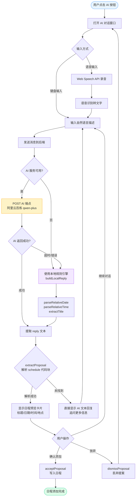

**降级策略说明**：
- 优先调用阿里云百炼 API
- API 不可用或超时时自动降级为本地规则引擎
- 本地引擎支持：相对日期（今天/明天/下周五）、星期、具体日期、时间段（上午/下午/晚上）
- 降级模式下仍能处理大部分常用输入，用户体验无显著差异

#### 3.5.2 AI 个人成长简历 (`POST /api/ai/resume`)

**设计**：
- 输入源：用户 profile (bio/goals/skills/interests) + 已完成日程 + 已发布动态
- 输出：`{ personalSummary, skillTags[], activityHighlights[], growthInsight, suggestedNextSteps[] }`
- AI 可用时优先调用大模型生成
- AI 不可用时使用 buildLocalResume() 本地算法生成
- 本地算法：从日程标题提取关键词映射为技能标签，根据完成数量生成成长洞察

**技能标签映射表**：
| 日程关键词 | 映射技能标签 |
|-----------|-------------|
| 学习/考试/复习/课程 | 学习 |
| 项目/答辩/论文/报告 | 项目管理/论文写作 |
| 运动/跑步/健身/游泳 | 运动/跑步/健身 |
| 编程/代码/开发/设计 | 编程/开发/设计 |
| 兼职/实习/工作 | 兼职/实习/工作 |
| 阅读/读书/写作 | 阅读/写作 |
| 社团/志愿/公益 | 社团活动/志愿服务 |
| 比赛/奖/面试 | 竞赛/获奖/面试 |

### 3.6 个人中心模块

**前端文件**: `components/views/ProfileView.vue` (~600 行)

**页面结构**（从上到下）：
1. **个人信息头部**：蓝白渐变背景 + 毛玻璃卡片，头像、昵称、欢迎语
2. **数据统计面板**：完成日程数 / 发布动态数（玻璃态卡片）
3. **AI 简历区域**（登录后展示）：
   - 个人概述卡片（橙色左边框）
   - 技能标签云（蓝色药丸标签）
   - 亮点时刻（时间轴+蓝色节点）
   - 成长洞察（绿色左边框）
   - 下一步建议（编号列表）
   - 重新生成按钮
4. **游客引导卡片**（未登录）：居中引导文案 + 登录/注册按钮
5. **底部操作区**：
   - 设置菜单项（分类管理、提醒推送、数据同步、通用设置）
   - 关于、退出登录、账号注销

**状态处理**：
- Loading 态：4 张玻璃态骨架屏卡片（shimmer 动画）
- Error 态：错误提示卡片 + 重试按钮
- Guest 态：引导登录卡片
- Loaded 态：完整 AI 简历

---

## 4. 数据库设计

### 4.1 ER 图

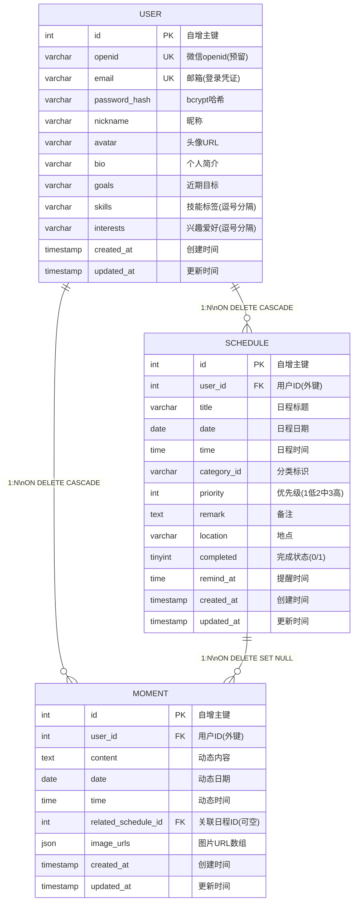

**关系说明**：
| 关系 | 基数 | 删除行为 |
|------|------|----------|
| USER → SCHEDULE | 一对多 | CASCADE：删除用户时级联删除其所有日程 |
| USER → MOMENT | 一对多 | CASCADE：删除用户时级联删除其所有动态 |
| SCHEDULE → MOMENT | 一对多 | SET NULL：删除日程时不删除关联动态，仅解除关联 |

### 4.2 表结构详解

#### user 表

```sql
CREATE TABLE user (
  id INT AUTO_INCREMENT PRIMARY KEY,
  openid VARCHAR(64) UNIQUE,          -- 微信 openid（预留）
  email VARCHAR(128) UNIQUE,          -- 邮箱（登录凭证）
  password_hash VARCHAR(255),         -- bcrypt 哈希
  nickname VARCHAR(64),               -- 昵称
  avatar VARCHAR(512),                -- 头像 URL
  bio VARCHAR(512) DEFAULT '',        -- 个人简介
  goals VARCHAR(1024) DEFAULT '',     -- 近期目标
  skills VARCHAR(1024) DEFAULT '',    -- 技能标签（逗号分隔）
  interests VARCHAR(1024) DEFAULT '', -- 兴趣爱好（逗号分隔）
  created_at TIMESTAMP DEFAULT CURRENT_TIMESTAMP,
  updated_at TIMESTAMP DEFAULT CURRENT_TIMESTAMP ON UPDATE CURRENT_TIMESTAMP
) ENGINE=InnoDB DEFAULT CHARSET=utf8mb4;
```

#### schedule 表

```sql
CREATE TABLE schedule (
  id INT AUTO_INCREMENT PRIMARY KEY,
  user_id INT NOT NULL,
  title VARCHAR(255) NOT NULL,
  date DATE NOT NULL,
  time TIME NOT NULL,
  category_id VARCHAR(64) NULL,       -- 分类标识
  priority INT NOT NULL DEFAULT 1,    -- 1低 2中 3高
  remark TEXT NULL,
  location VARCHAR(255) NULL,
  completed TINYINT(1) NOT NULL DEFAULT 0,
  remind_at TIME NULL,                -- 提醒时间
  created_at TIMESTAMP DEFAULT CURRENT_TIMESTAMP,
  updated_at TIMESTAMP DEFAULT CURRENT_TIMESTAMP ON UPDATE CURRENT_TIMESTAMP,
  INDEX idx_schedule_user_date (user_id, date),
  CONSTRAINT fk_schedule_user FOREIGN KEY (user_id)
    REFERENCES user(id) ON DELETE CASCADE
) ENGINE=InnoDB DEFAULT CHARSET=utf8mb4;
```

#### moment 表

```sql
CREATE TABLE moment (
  id INT AUTO_INCREMENT PRIMARY KEY,
  user_id INT NOT NULL,
  content TEXT NOT NULL,
  date DATE NOT NULL,
  time TIME NOT NULL,
  related_schedule_id INT NULL,       -- 关联日程 ID
  image_urls JSON NULL,               -- 图片 URL 数组
  created_at TIMESTAMP DEFAULT CURRENT_TIMESTAMP,
  updated_at TIMESTAMP DEFAULT CURRENT_TIMESTAMP ON UPDATE CURRENT_TIMESTAMP,
  INDEX idx_moment_user_date (user_id, date),
  CONSTRAINT fk_moment_user FOREIGN KEY (user_id)
    REFERENCES user(id) ON DELETE CASCADE,
  CONSTRAINT fk_moment_schedule FOREIGN KEY (related_schedule_id)
    REFERENCES schedule(id) ON DELETE SET NULL
) ENGINE=InnoDB DEFAULT CHARSET=utf8mb4;
```

### 4.3 索引设计

| 表 | 索引 | 用途 |
|----|------|------|
| schedule | idx_schedule_user_date (user_id, date) | 按用户+日期查询日程 |
| moment | idx_moment_user_date (user_id, date) | 按用户+日期查询动态 |
| user | email (UNIQUE) | 邮箱唯一性校验 |
| user | openid (UNIQUE) | 微信 openid 唯一性校验 |

### 4.4 外键约束与数据完整性

| 约束 | 表 | 行为 |
|------|-----|------|
| fk_schedule_user | schedule → user | ON DELETE CASCADE（删除用户时级联删除日程） |
| fk_moment_user | moment → user | ON DELETE CASCADE（删除用户时级联删除动态） |
| fk_moment_schedule | moment → schedule | ON DELETE SET NULL（删除日程时不删除动态，解除关联） |

---

## 5. API 接口设计

### 5.1 接口规范

- 协议：HTTP/HTTPS
- 数据格式：JSON (Content-Type: application/json)
- 认证方式：Authorization: Bearer \<JWT\>
- 错误响应格式：`{ "message": "错误描述" }`
- 成功响应格式：视接口而定，通常包含 `ok: true` 或具体数据

### 5.2 完整端点列表

#### 健康检查

| 方法 | 路径 | 认证 | 响应 |
|------|------|------|------|
| GET | /api/health | 无 | `{ status: "ok", timestamp: "..." }` |

#### 用户认证

| 方法 | 路径 | 认证 | 请求体 | 响应 |
|------|------|------|--------|------|
| POST | /api/auth/register | 无 | `{ email, password, nickname?, bio?, goals?, skills?, interests? }` | 201: `{ token, user: {...} }` |
| POST | /api/auth/login | 无 | `{ email, password }` | 200: `{ token, user: {...} }` |
| POST | /api/auth/wechat | 无 | `{ code }` | 200: `{ token, user: {...} }` |
| GET | /api/auth/profile | JWT | — | 200: `{ id, email, nickname, avatar, bio, goals, skills, interests }` |
| PUT | /api/auth/profile | JWT | `{ nickname?, avatar?, bio?, goals?, skills?, interests? }` | 200: `{ ok: true }` |
| DELETE | /api/auth/account | JWT | — | 200: `{ ok: true, message: "Account deleted." }` |

**注册校验规则**：
- email：必填，格式校验 `/^[^\s@]+@[^\s@]+\.[^\s@]+$/`
- password：必填，最小长度 6 位
- 邮箱重复：返回 409

#### 日程 CRUD

| 方法 | 路径 | 认证 | 说明 |
|------|------|------|------|
| GET | /api/schedules | JWT | 获取当前用户全部日程（按日期+时间倒序） |
| POST | /api/schedules | JWT | 创建日程，必填 { title, date, time } |
| PUT | /api/schedules/:id | JWT | 动态更新日程（只更新传入字段） |
| DELETE | /api/schedules/:id | JWT | 删除日程（需匹配 user_id） |

**日程创建请求体**：
```json
{
  "title": "计算机网络大作业提交",
  "date": "2026-06-30",
  "time": "14:00",
  "categoryId": "cat-study",
  "priority": 3,
  "remark": "需要提交到教务处系统",
  "location": "教学楼A201",
  "completed": false,
  "remindAt": "13:30"
}
```

**PUT 动态更新**：遍历 req.body 中的字段，只将实际传入的字段拼入 SQL SET 子句。若没有任何字段需要更新，返回 400。

#### 动态 CRUD

| 方法 | 路径 | 认证 | 说明 |
|------|------|------|------|
| GET | /api/moments | JWT | 获取当前用户全部动态（按日期+时间倒序） |
| POST | /api/moments | JWT | 创建动态 |
| PUT | /api/moments/:id | JWT | 动态更新动态 |
| DELETE | /api/moments/:id | JWT | 删除动态 |

**动态创建请求体**：
```json
{
  "content": "今天终于把网络大作业搞定了！",
  "date": "2026-06-15",
  "time": "15:30",
  "relatedScheduleId": 42,
  "imageUrls": ["/uploads/abc123.jpg"]
}
```

**relatedScheduleId 净化**：后端自动将非数字值（如本地 ID "sch-xxx"）净化为 null。

#### AI 接口

| 方法 | 路径 | 认证 | 超时 | 说明 |
|------|------|------|------|------|
| POST | /api/ai/chat | 无 | 60s | AI 日程生成 |
| POST | /api/ai/resume | JWT | 30s | AI 成长简历 |

**AI Chat 请求体**：
```json
{
  "messages": [
    { "role": "user", "content": "明天下午3点去图书馆学习" }
  ],
  "schedules": [ ... ]
}
```

**AI Chat 响应**：
```json
{
  "reply": "好的，我帮你整理好了...",
  "proposal": {
    "title": "去图书馆学习",
    "date": "2026-06-17",
    "time": "15:00",
    "priority": 2,
    "remark": "",
    "location": "图书馆"
  },
  "fallback": false
}
```

**AI Resume 响应**：
```json
{
  "personalSummary": "陈同学，计算机专业学生...",
  "skillTags": ["学习", "编程", "项目管理", "运动"],
  "activityHighlights": [
    { "title": "完成网络大作业", "date": "2026-06-15", "description": "..." }
  ],
  "growthInsight": "已完成 8 项日程，执行力令人印象深刻！",
  "suggestedNextSteps": [
    "朝着「通过期末考试」的目标再迈一步",
    "回顾已完成的事项，给自己一个小小的奖励"
  ]
}
```

#### 文件上传

| 方法 | 路径 | 认证 | 说明 |
|------|------|------|------|
| POST | /api/upload | 无 | multipart 文件上传或 Base64 Data URL |

**响应**：`{ "url": "/uploads/1718000000-abc123.jpg" }`

**支持格式**：jpg, jpeg, png, gif, webp, bmp  
**大小限制**：10MB  
**两种上传方式**：
1. multipart/form-data（原生 uploadFile）
2. Base64 Data URL（H5 blob 转换后上传）

### 5.3 错误码汇总

| HTTP 状态码 | 含义 | 常见场景 |
|------------|------|----------|
| 200 | 成功 | GET/PUT/DELETE 成功 |
| 201 | 创建成功 | POST 注册/创建日程 |
| 400 | 请求错误 | 缺少必填字段、格式错误 |
| 401 | 未认证 | Token 缺失或无效 |
| 404 | 未找到 | 资源不存在 |
| 409 | 冲突 | 邮箱已注册 |
| 500 | 服务器错误 | 数据库异常等（被全局错误处理捕获） |

### 5.4 全局错误处理

Express 全局错误中间件捕获所有路由异常：
```javascript
app.use((err, req, res, _next) => {
  console.error('[Server Error]', err.message || err)
  if (!res.headersSent) {
    res.status(500).json({ message: 'Internal server error', error: err.message })
  }
})
```

避免未捕获异常导致进程崩溃。

---

## 6. 前端组件设计

### 6.1 组件树

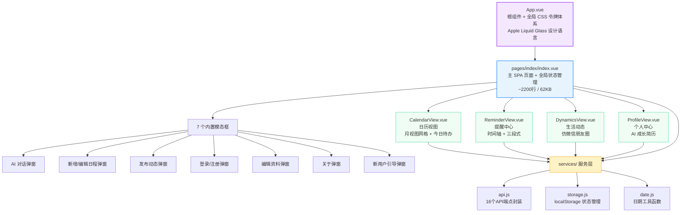

**组件职责划分**：
| 组件 | 层级 | 职责 |
|------|------|------|
| App.vue | 顶层 | 全局 CSS 变量、动画定义、应用生命周期 |
| index.vue | 页面层 | 状态管理、Tab 路由、模态框管理、认证流程 |
| CalendarView | 视图层 | 日历渲染、日期选择、日程列表 |
| ReminderView | 视图层 | 时间轴渲染、待办排序、推送设置 |
| DynamicsView | 视图层 | 动态流渲染、图片处理、文本折叠 |
| ProfileView | 视图层 | 个人信息展示、AI 简历、设置菜单 |

### 6.2 App.vue — 全局 CSS 令牌体系

**设计语言**：Apple Liquid Glass（玻璃拟态）

**核心令牌**：

```css
/* 透明度层级 (7 档) */
--glass-bg-card: rgba(255,255,255,0.40);    /* 卡片 */
--glass-bg-panel: rgba(255,255,255,0.55);   /* 面板 */
--glass-bg-nav: rgba(255,255,255,0.80);     /* 导航栏 */
--glass-bg-overlay: rgba(255,255,255,0.90); /* 覆盖层 */

/* 模糊层级 (5 档) */
--glass-blur-xs: blur(6px);
--glass-blur-sm: blur(12px);
--glass-blur-md: blur(18px);
--glass-blur-lg: blur(26px);
--glass-blur-xl: blur(38px);

/* 阴影栈 (6 种) */
--shadow-glass-sm: inset 0 0.5px 0 rgba(255,255,255,0.6),
                   0 0 0 1px rgba(0,0,0,0.04),
                   0 1px 2px rgba(0,0,0,0.06),
                   0 2px 8px rgba(74,158,255,0.06);

/* 颜色系统 */
--color-primary: #4A9EFF;
--color-success: #34D399;
--color-warning: #FFA500;
--color-danger: #EF4444;
--text-primary: #121926;
--text-secondary: #5F6B7A;

/* 间距 */
--space-xs: 4px;  --space-sm: 8px;  --space-md: 12px;
--space-lg: 16px; --space-xl: 20px; --space-2xl: 24px;

/* 圆角 */
--radius-sm: 8px;  --radius-md: 12px;  --radius-lg: 16px;
--radius-xl: 20px; --radius-full: 9999px;

/* 字体风格 */
--font-mono: 'SF Mono', monospace;
--font-weight-semibold: 590;
--letter-spacing-tight: -0.03em;
```

### 6.3 pages/index/index.vue — 主 SPA 页面

**职责**：全局状态管理、底部导航、模态框管理、认证流程

**状态变量**（data/ref）：
| 变量 | 类型 | 说明 |
|------|------|------|
| currentTab | string | 当前激活的标签页 |
| schedules | array | 日程列表 |
| moments | array | 动态列表 |
| session | object | 用户会话信息 |
| settings | object | 应用设置 |
| showAuthModal | boolean | 认证弹窗显示 |
| showAIModal | boolean | AI 对话弹窗显示 |
| showOnboarding | boolean | 新用户引导弹窗 |
| showAboutModal | boolean | 关于弹窗 |
| authMode | string | 'login' / 'register' |
| authError | string | 认证错误提示 |

**关键方法**：
| 方法 | 说明 |
|------|------|
| loadState() | 从 localStorage 加载状态 |
| saveState() | 持久化状态到 localStorage |
| loadServerData(isNewUser) | 从服务端同步数据，isNewUser 时清空本地 |
| submitAuth() | 提交登录/注册表单 |
| logout() | 退出登录，清除状态 |
| handleDeleteAccount() | 注销账号（二次确认） |

**数据合并策略**：
```
loadServerData():
  1. 获取服务端 schedules/moments
  2. 若 isNewUser: 清空本地 → 直接使用服务端数据
  3. 否则: 保留本地独有数据 + 合并服务端数据
  4. 服务端数据直接替换同 ID 的本地条目
```

### 6.4 CalendarView.vue — 日历视图

**功能**：
- 月视图日历网格（30 天）
- 月份切换（上月/下月 + 今日按钮）
- 视图切换（天/周/月 — 预留）
- 彩色分类小标识（格子内横向排列）
- 点击日期快速新增日程
- 今日待办列表（底部）

**Props**：
- schedules: 日程列表
- categories: 分类列表

**Emits**：
- add-schedule(payload): 新增日程
- update-schedule(id, changes): 更新日程
- delete-schedule(id): 删除日程
- toggle-completed(id): 切换完成状态
- select-date(date): 选择日期

### 6.5 ReminderView.vue — 提醒中心

**功能**：
- 时间轴布局展示所有待办
- 三段式：今日剩余 / 未来待办 / 已过期
- 已完成任务划线+降低不透明度
- 晨间推送设置

**排序规则**：
1. 未完成 > 已完成
2. 今日 > 未来 > 已过期
3. 同组内按时间升序

### 6.6 DynamicsView.vue — 生活动态

**功能**：
- 竖版左侧日期布局（仿微信朋友圈）
- 图片九宫格 + 点击预览
- 长文本折叠/展开
- 关联日程链接卡片
- 微信绿 FAB 发布按钮
- 相对时间显示

**图片处理**：
- safeImageUrls()：过滤过期 Blob URL（blob: 前缀）
- 图片加载失败时隐藏 `@error` handler
- 支持点击全屏预览

### 6.7 ProfileView.vue — 个人中心

**功能**：
- 个人信息展示 + 编辑
- AI 个人成长简历卡片
- 技能标签云
- 设置菜单
- 账号注销（二次确认）

**状态机**：

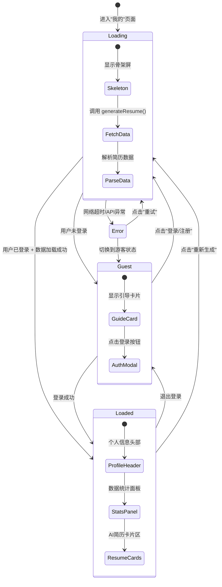

**状态说明**：
| 状态 | 触发条件 | UI 表现 |
|------|----------|---------|
| Loading | 页面挂载 / 登录 / 重试 | 4 张玻璃态骨架屏，shimmer 动画 |
| Error | API 超时 / 网络错误 / 服务端异常 | 红色错误卡片 + "重试"按钮 |
| Guest | session.isGuest === true | 居中引导卡片 + 登录/注册按钮 |
| Loaded | 登录用户 + 数据获取成功 | 完整个人信息 + AI 简历卡片 |

**Props**：
- session: 用户会话
- schedules: 日程列表
- moments: 动态列表
- resumeData: AI 简历数据
- resumeLoading: 加载状态
- resumeError: 错误信息

**Emits**：
- open-auth-modal(mode): 打开认证弹窗
- open-about-modal: 打开关于弹窗
- logout: 退出登录
- delete-account: 注销账号
- refresh-resume: 重新生成简历

---

## 7. 安全设计

### 7.1 认证安全

- JWT 密钥存储在服务端环境变量 `.env`，不在代码中硬编码
- 启动时检查 JWT_SECRET 是否为默认值，若是则输出警告
- Token 有效期 7 天，过期需重新登录
- 密码使用 bcrypt (10 轮 salt) 哈希存储

### 7.2 数据隔离

- 所有数据操作附加 `WHERE user_id = ?` 条件
- JWT 中间件从 Token 解析 userId 注入 req.user
- 用户只能访问自己的日程、动态、资料

### 7.3 数据库安全

- 使用参数化查询（`db.query(sql, params)`），防止 SQL 注入
- 数据库连接池 limit 10，防止连接耗尽
- 密码不在日志中输出

### 7.4 文件上传安全

- 文件类型白名单：jpg, jpeg, png, gif, webp, bmp
- 文件大小限制：10MB
- 文件名随机生成，防止路径遍历
- Base64 上传格式校验：必须匹配 `data:image/...;base64,...`

### 7.5 输入校验

- 邮箱格式校验
- 密码最小长度校验
- 日程/动态必填字段校验
- relatedScheduleId 类型净化（非数字 → null）

---

## 8. 部署架构

### 8.1 开发环境

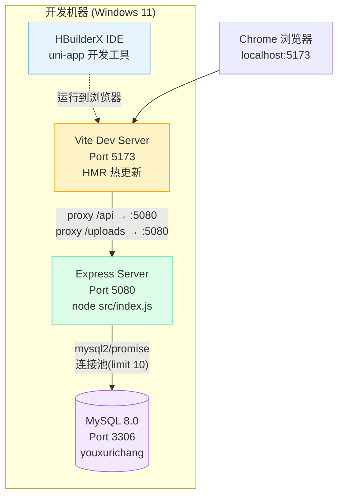

### 8.2 生产环境

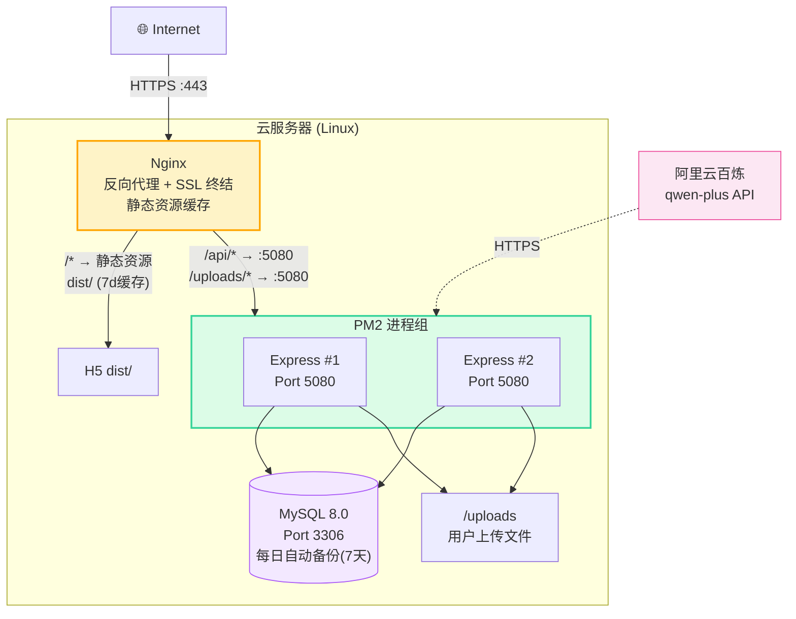

**生产环境特性**：
- **Nginx**：SSL 终结、静态资源缓存（7天）、反向代理到 Express
- **PM2**：双实例负载均衡 + 自动重启 + 进程守护
- **MySQL**：每日自动备份，保留 7 天历史
- **静态资源**：H5 构建产物 dist/，CSS/JS/图片带缓存，HTML 无缓存

### 8.3 环境变量配置 (.env)

```
DB_HOST=127.0.0.1
DB_PORT=3306
DB_USER=your_user
DB_PASSWORD=your_password
DB_NAME=youxurichang
JWT_SECRET=your-strong-secret-here
PORT=5080
AI_ENDPOINT=https://dashscope.aliyuncs.com/compatible-mode/v1
AI_API_KEY=your-aliyun-api-key
AI_MODEL=qwen-plus
WECHAT_APPID=your-wechat-appid
WECHAT_APPSECRET=your-wechat-secret
SSL_KEY_PATH=/etc/ssl/private/key.pem
SSL_CERT_PATH=/etc/ssl/certs/cert.pem
STATIC_DIR=../../dist
```

### 8.4 部署步骤

1. 服务器安装 Node.js 18+ 和 MySQL 8.0
2. 拉取代码，`cd server && npm install`
3. 配置 `.env`（数据库、JWT、AI API Key）
4. 运行 `node scripts/init_db.js` 初始化表结构
5. 构建前端：HBuilderX → 发行 → 网站-H5手机版
6. 将 dist/ 部署到服务器
7. `pm2 start src/index.js --name youxurichang -i 2`
8. 配置 Nginx 反向代理 + SSL

### 8.5 数据库初始化

```bash
cd server
node scripts/init_db.js   # 执行 schema.sql 创建表
# 如果表已存在则跳过（IF NOT EXISTS）
```

---

## 附录 A. 关键技术决策记录

| 决策 | 选择 | 理由 |
|------|------|------|
| 前端框架 | uni-app (Vue 3) | 一套代码多端运行，降低维护成本 |
| 状态管理 | localStorage + 响应式变量 | 场景简单，无需引入 Vuex/Pinia |
| API 请求封装 | uni.request 包装 | 跨平台兼容 (H5/App/小程序) |
| 数据库 ORM | 原生 SQL (mysql2) | 简单 CRUD，ORM 引入无必要复杂度 |
| 图片存储 | 服务器本地 + /uploads 静态服务 | MVP 阶段无需云存储成本 |
| AI 降级 | 本地规则引擎 | 确保 AI 不可用时核心功能可用 |
| CSS 方案 | 全局 CSS 变量令牌 | 统一设计系统，易于主题切换 |
| 离线策略 | Local-First | 确保无网络时应用仍可使用 |

## 附录 B. 文件大小统计

| 文件 | 行数 | 大小 | 说明 |
|------|------|------|------|
| pages/index/index.vue | ~2200 | 62KB | 主 SPA 页面 |
| components/views/ProfileView.vue | ~600 | 21KB | 个人中心 |
| components/views/CalendarView.vue | ~500 | 18KB | 日历视图 |
| components/views/ReminderView.vue | ~350 | 14KB | 提醒中心 |
| components/views/DynamicsView.vue | ~700 | 24KB | 生活动态 |
| services/api.js | 110 | 4KB | API 封装 |
| services/storage.js | 240 | 7KB | 本地存储 |
| server/src/index.js | 115 | 3KB | 服务入口 |
| server/src/routes/ai.js | 360 | 15KB | AI 路由 |
| server/src/routes/auth.js | 166 | 6KB | 认证路由 |
| server/src/routes/schedules.js | 103 | 3KB | 日程路由 |
| server/src/routes/moments.js | 120 | 4KB | 动态路由 |
| server/src/routes/upload.js | 72 | 2KB | 上传路由 |
